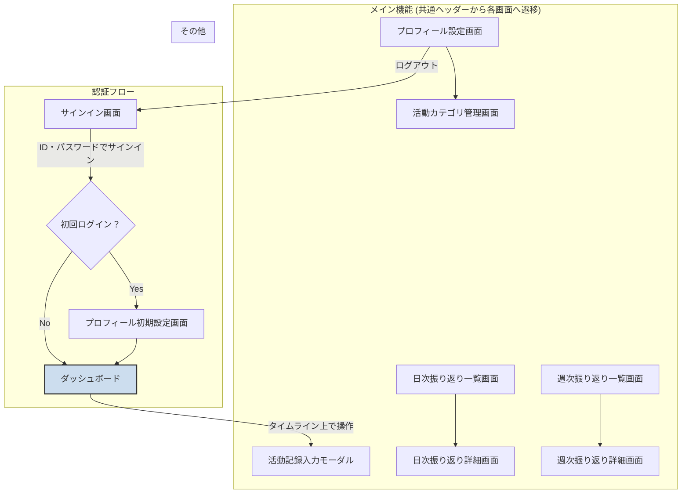

# UI/UX設計

本アプリケーション名：ひびログ

## 主要なユーザーフロー

1.  **ユーザーオンボーディング**:
    *   ID・パスワードでのサインイン
    *   初回利用時の簡単なプロフィール設定（もし必要であれば）

2.  **行動記録の入力**:
    *   現在の活動や過去の活動を記録するフロー

3.  **日次・週次振り返りの閲覧**:
    *   日々の活動と心身の負荷の傾向を確認するフロー
    *   週ごとの集計とAI診断結果を確認するフロー

4.  **活動カテゴリの管理**:
    *   カスタムカテゴリの追加、編集、削除を行うフロー

## 画面遷移図



## 共通コンポーネント

### 共通ヘッダー
アプリケーションの全てのメイン画面の上部に表示されるナビゲーションバー。
*   **ロゴ/ホーム**: クリックするとダッシュボード画面に戻る。
*   **ナビゲーションリンク**:
    *   ダッシュボード
    *   日次振り返り
    *   週次振り返り
*   **ユーザーメニュー**:
    *   プロフィール設定画面へのリンク
    *   ログアウト

## 主要な画面（スクリーン）の概要

1.  **サインイン/オンボーディング画面**:
    *   Googleサインインボタン。
    *   （初回のみ）ユーザー名、タイムゾーンなどの初期設定フォーム。

2.  **ダッシュボード/ホーム画面**:
    *   **メインビュー**: 今日の日付と曜日が表示され、0時から24時までの縦型タイムラインが画面の主要部分を占める。
    *   **日付・ナビゲーションUI**:
        *   画面上部に「今日の日付（例：07月06日(日)）」が大きく表示され、クリックで日付ピッカーが開く。
        *   日付の下に「今日」「＜」「＞」ボタンが左端に横並びで配置され、日付移動ができる。
        *   右端には「日」「週」「月」ボタンが横並びで配置され、カレンダーの表示切替ができる。
        *   カレンダー本体（react-big-calendar）はデフォルトのツールバー（下部のナビゲーションUI）を非表示にしている。
    *   **活動表示**: 記録された活動は、時間に応じた長さのブロックとしてタイムライン上に表示される。ブロックには活動カテゴリと内容が表示される。
    *   **活動の追加**:
        *   タイムラインの空いている時間をクリックまたはドラッグして範囲選択すると、活動記録入力モーダルがポップアップする。
        *   各時間帯の横に「+」ボタンがあり、クリックすると同様にモーダルが開く。
    *   **累計時間表示**: 画面の隅に「本日の累計勤務時間: X時間Y分」のように、"業務"カテゴリの活動時間合計を表示する。

3.  **活動記録入力モーダル**:
    *   ダッシュボードのタイムライン操作に応じて表示されるポップアップウィンドウ。
    *   開始時刻、終了時刻の入力フィールド（タイムラインで選択した時間が自動入力）。
    *   カテゴリの選択（「業務」「睡眠」「学習」「プライベート」の4択、固定。活動内容の上に配置）。
    *   活動内容のテキスト入力エリア。
    *   心身の負荷レベルの入力（スライダー、ラジオボタンなど）。
    *   負荷に関する自由記述のテキストエリア。
    *   保存ボタン、キャンセルボタン、削除ボタン。

4.  **日次振り返り一覧・詳細画面**:
    *   カレンダー形式で日付を選択できる。
    *   選択された日付の活動記録一覧、総活動時間、平均疲労レベル。
    *   チェックポイント評価の表示と編集。
    *   ユーザーコメント、AIコメントの表示。

5.  **週次振り返り一覧・詳細画面**:
    *   週を選択すると、その週の活動サマリー（総活動時間、平均疲労レベル、最頻カテゴリなど）を表示。
    *   振り返りノート、AI診断結果の表示。
    *   **週次振り返り入力UI**:
        *   6問の設問文＋5段階評価（ラジオボタンやスライダー等）
            *   例：
                1. 今週は十分な睡眠が取れましたか？
                2. 今週はバランスの良い食事ができましたか？
                3. 今週は適度な運動ができましたか？
                4. 今週はストレスを感じることが多かったですか？
                5. 今週は仕事や学業に集中できましたか？
                6. 今週は気分が前向きでしたか？
        *   「不安なこと」「良かったこと」のテキスト入力欄
        *   「AI診断」ボタン（上記内容をまとめてAI診断APIに送信）
        *   AI診断コメントの表示欄
    *   **AI診断リクエスト内容**:
        *   タイトル（例：週次振り返りAI診断）
        *   設問文＋スコア配列（例：[{"text": "今週は十分な睡眠が取れましたか？", "score": 4}, ...]）
        *   不安なこと（テキスト）
        *   良かったこと（テキスト）
    *   **週次振り返り一覧画面の改善**:
        *   日付表示形式：「YYYY-MM-DD週」（例：2025-06-23週）
        *   最新4週分のみ表示（パフォーマンス向上）
        *   **グラフ機能追加**：
            *   週次負荷ポイント・設問スコア推移グラフ（2軸表示）
            *   負荷ポイント：棒グラフ（左軸）
            *   設問スコア合計：折れ線グラフ（右軸）
            *   時系列での傾向分析が可能

6.  **活動カテゴリ管理画面**:
    *   システム定義カテゴリとユーザー定義カテゴリの一覧表示。
    *   新しいカテゴリを追加、編集、削除する機能。

7.  **プロフィール設定画面**:
    *   表示名、プロフィール画像の表示と編集。
    *   各種設定（通知設定など）。

## エラーハンドリング・注意事項

### BigQueryストリーミングバッファ（活動記録・週次振り返り共通）

- 活動記録や週次振り返りを登録直後は、BigQueryのストリーミングバッファ仕様により、DELETEやUPDATEができません。
- バッファが解放されるまでの時間は数分〜最大2時間程度かかる場合があります。
- この間に削除や編集を試みると、以下のようなエラーメッセージが表示されます：

> このデータは登録直後のため、2時間程度削除できない場合があります（BigQueryの仕様）。しばらくしてから再度お試しください。

- バッファが解放されると、通常通り削除・編集が可能になります。

### CORS・manifest.jsonの注意事項

- CORSは本番Cloud RunのURL（例：https://health-report-465810-621003261884.us-central1.run.app）をFlaskのCORS許可リストに必ず追加すること。
- manifest.jsonはReactビルド時に自動生成される。Flaskで /manifest.json を静的に返すルートを追加すること。

### 週次振り返り保存時のエラーハンドリング

- 保存時に400エラーが発生した場合、詳細なエラーメッセージを表示
- BigQueryストリーミングバッファエラーの場合は、ユーザーフレンドリーなメッセージを表示
- ローディング状態の表示：
  *   AI診断中：「AI診断中です。しばらくお待ちください...」
  *   保存中：「保存中です...」
  *   週次サマリー取得中：「読み込み中...」

## 仕様更新履歴・注意事項

- **活動量（KPI）**：勤務・学習カテゴリの「作業時間×疲労レベル」の合計を「活動量」としてダッシュボードに表示。
- **疲労レベル（負荷）**：0〜5の範囲で入力可能。
- **カレンダー表示仕様**：活動記録は日付を跨いで登録できるが、カレンダー「日」ビューでは「開始日」にのみ表示される（終了日には表示されない）。週・月ビューではバーとして両日にまたがって表示される。

## 開発・デプロイ手順まとめ

### 開発環境（ローカル）

1. 必要な.envファイルをapp.pyと同じディレクトリに配置（.env.development など）
2. 必要なパッケージをインストール
   ```sh
   pip install -r requirements.txt
   ```
3. 環境変数をセットしてFlaskアプリを起動
   ```sh
   export FLASK_ENV=development
   export OAUTHLIB_INSECURE_TRANSPORT=1
   python app.py
   ```

### 本番環境（Cloud Runデプロイ）

1. .env.productionをapp.pyと同じディレクトリに配置 stop_dev.sh
2. React本番ビルド static/frontend
    npm install
    npm run build
3 gcloudでDocker認証
gcloud auth configure-docker us-central1-docker.pkg.dev
4. Dockerイメージのビルド プロジェクトルート venv外　Desktop Dockerを起動した状態で
docker buildx build --platform linux/amd64 -t us-central1-docker.pkg.dev/health-report-465810/health-report-465810/health-report-465810-image:latest --push .
5. Cloud Runへデプロイ


gcloud run deploy health-report-465810 \
  --image us-central1-docker.pkg.dev/health-report-465810/health-report-465810/health-report-465810-image:latest \
  --platform managed \
  --region us-central1 \
  --allow-unauthenticated \
  --set-env-vars FLASK_SECRET_KEY=xmyapp_health_report_465810_key,FLASK_ENV=production \
  --project=health-report-465810

- Cloud Runの管理画面で環境変数（FLASK_ENV=productionなど）を追加してもOK
- デプロイ後は https でアクセス

### Flaskのcatch-allルーティングについて

- APIリクエスト（パスが`/api/`で始まるもの）は404を返す。
- それ以外の全てのパス（例：/login, /dashboard, /register など）は`index.html`を返し、React RouterによるSPAルーティングが機能するようにしている。
- これにより、ブラウザで直接URLを叩いてもSPAの画面が正しく表示される。
