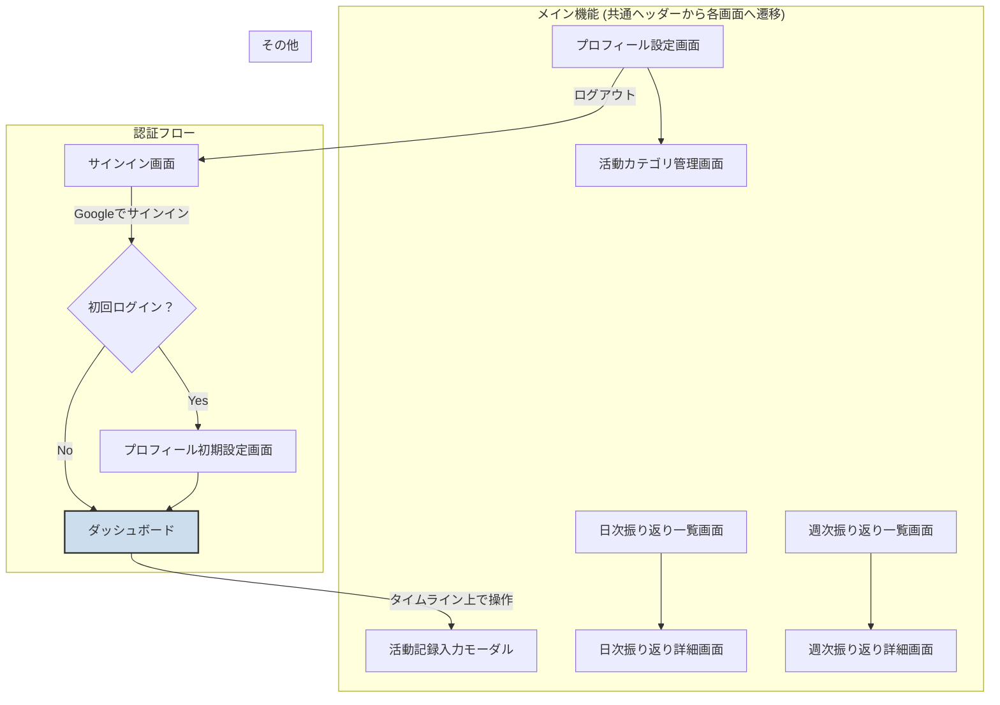

# UI/UX設計

## 主要なユーザーフロー

1.  **ユーザーオンボーディング**:
    *   Googleアカウントでのサインイン
    *   初回利用時の簡単なプロフィール設定（もし必要であれば）

2.  **行動記録の入力**:
    *   現在の活動や過去の活動を記録するフロー

3.  **日次・週次振り返りの閲覧**:
    *   日々の活動と心身の負荷の傾向を確認するフロー
    *   週ごとの集計とAI診断結果を確認するフロー

4.  **活動カテゴリの管理**:
    *   カスタムカテゴリの追加、編集、削除を行うフロー

## 画面遷移図

## 共通コンポーネント

### 共通ヘッダー
アプリケーションの全てのメイン画面の上部に表示されるナビゲーションバー。
*   **ロゴ/ホーム**: クリックするとダッシュボード画面に戻る。
*   **ナビゲーションリンク**:
    *   ダッシュボード
    *   日次振り返り
    *   週次振り返り
*   **ユーザーメニュー**:
    *   プロフィール設定画面へのリンク
    *   ログアウト

## 主要な画面（スクリーン）の概要

1.  **サインイン/オンボーディング画面**:
    *   Googleサインインボタン。
    *   （初回のみ）ユーザー名、タイムゾーンなどの初期設定フォーム。

2.  **ダッシュボード/ホーム画面**:
    *   **メインビュー**: 今日の日付と曜日が表示され、0時から24時までの縦型タイムラインが画面の主要部分を占める。
    *   **活動表示**: 記録された活動は、時間に応じた長さのブロックとしてタイムライン上に表示される。ブロックには活動カテゴリと内容が表示される。
    *   **活動の追加**:
        *   タイムラインの空いている時間をクリックまたはドラッグして範囲選択すると、活動記録入力モーダルがポップアップする。
        *   各時間帯の横に「+」ボタンがあり、クリックすると同様にモーダルが開く。
    *   **累計時間表示**: 画面の隅に「本日の累計勤務時間: X時間Y分」のように、"業務"カテゴリの活動時間合計を表示する。

3.  **活動記録入力モーダル**:
    *   ダッシュボードのタイムライン操作に応じて表示されるポップアップウィンドウ。
    *   開始時刻、終了時刻の入力フィールド（タイムラインで選択した時間が自動入力）。
    *   活動内容のテキスト入力エリア。
    *   活動カテゴリの選択（ドロップダウンまたはタグ選択）。
    *   心身の負荷レベルの入力（スライダー、ラジオボタンなど）。
    *   負荷に関する自由記述のテキストエリア。
    *   保存ボタン、キャンセルボタン、削除ボタン。

4.  **日次振り返り一覧・詳細画面**:
    *   カレンダー形式で日付を選択できる。
    *   選択された日付の活動記録一覧、総活動時間、平均疲労レベル。
    *   チェックポイント評価の表示と編集。
    *   ユーザーコメント、AIコメントの表示。

5.  **週次振り返り一覧・詳細画面**:
    *   週を選択すると、その週の活動サマリー（総活動時間、平均疲労レベル、最頻カテゴリなど）を表示。
    *   振り返りノート、AI診断結果の表示。

6.  **活動カテゴリ管理画面**:
    *   システム定義カテゴリとユーザー定義カテゴリの一覧表示。
    *   新しいカテゴリを追加、編集、削除する機能。

7.  **プロフィール設定画面**:
    *   表示名、プロフィール画像の表示と編集。
    *   各種設定（通知設定など）。
